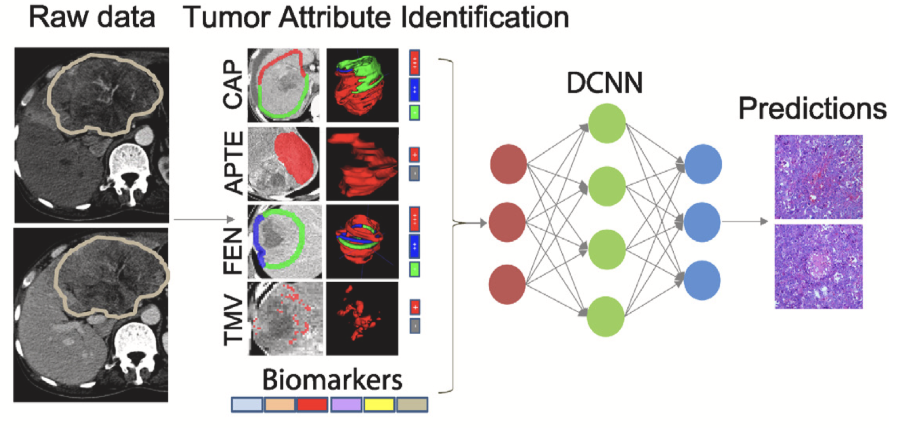
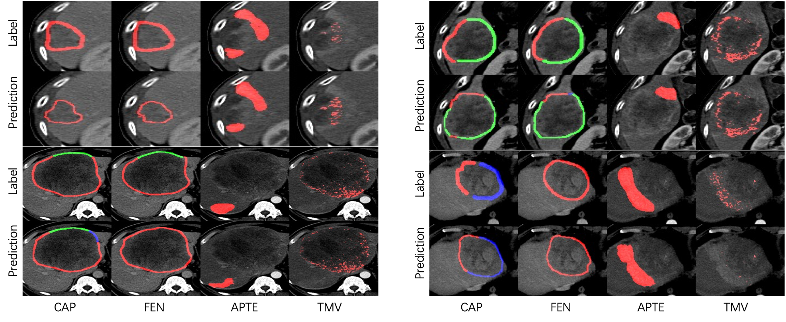

# TED: Two-Stage Expert-Guided Interpretable Diagnosis Framework for Microvascular Invasion in Hepatocellular Carcinoma

This repository is an official PyTorch implementation of "[TED: Two-Stage Expert-Guided Interpretable Diagnosis Framework for Microvascular Invasion in Hepatocellular Carcinoma](https://www.sciencedirect.com/science/article/abs/pii/S1361841522002158)" published in Medical Image Analysis 2022.

## Introduction
We design a two-stage interpretable diagnostic framework for MVI in HCC, namely TED, which can simulate the decision-making process of radiologists. Different from the black-box model of direct training, our TED extract four key clinical attributes (CAP, FEN, APTE and TMV)  and biomarkers to guide the training of the MVI diagnosis network.



Sonme visualization of attribute prediction:




## Test
Before testing, you need to set the path `data_path`, `middle_path` and `results_path` in `run_ted.sh`.
- `data_path`(input): Folder for storing CT data to be tested
File Structure (for example):
```
./$data_path$
├── patient1_pid             # Name the folder with PID       
│   ├── artery_img.nii       # Arterial phase CT
│   └── vein_img.nii         # Venous CT
├── patient2_pid                     
│   ├── artery_img.nii
│   └── vein_img.nii

```
- `middle_path`(output): Folder for storing automatically generated attribute prediction
File Structure (for example):
```
./$middle_path$
├── patient1_pid                            # Name the folder with PID       
│   ├── cap                                 # CAP (slice-level)
│   ├── fen                                 # FEN (slice-level)
│   ├── $patient1_pid$_tmv_artery.nii.gz    # TMV 
│   └── $patient1_pid$_ace_artery.nii.gz    # APTE/ACE
├── patient2_pid                     
│   ├── cap                                 
│   ├── fen                                 
│   ├── $patient1_pid$_tmv_artery.nii.gz    
│   └── $patient1_pid$_ace_artery.nii.gz    

```
- `results_path`(output): Folder for storing automatically generated biomarkers and diagnostic results
File Structure (for example):
```
./$data_path$
└── final_predict.csv 
```
After setting the path for testing, simply run:
```
bash run_ted.sh
```


## Train

Taking into account device differences and data privacy, you need to train your own model, please refer to the following:
```
$artery$ = ./artery_code/code_main/readme.md
$vein$ = ./vein_code/code_main/readme.md
$mvi$ = ./mvi_code/code_main/readme.md
```
- `$artery$`: How to train the model for predicting TMV and APTE/ACE
- `$vein$`: How to train the model for predicting CAP and FEN
- `$mvi$`: How to train the model for predicting MVI


## Citation

If you find this repository useful to your research, please consider citing:
~~~
@article{zhou2022ted,
  title={TED: Two-stage expert-guided interpretable diagnosis framework for microvascular invasion in hepatocellular carcinoma},
  author={Zhou, Yuhang and Sun, Shu-Wen and Liu, Qiu-Ping and Xu, Xun and Zhang, Ya and Zhang, Yu-Dong},
  journal={Medical Image Analysis},
  volume={82},
  pages={102575},
  year={2022},
  publisher={Elsevier}
}
~~~
